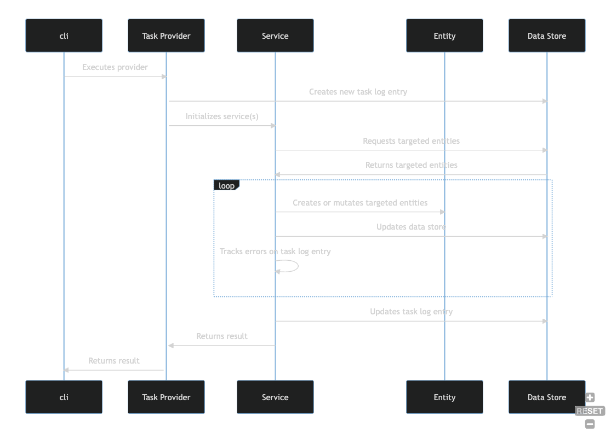
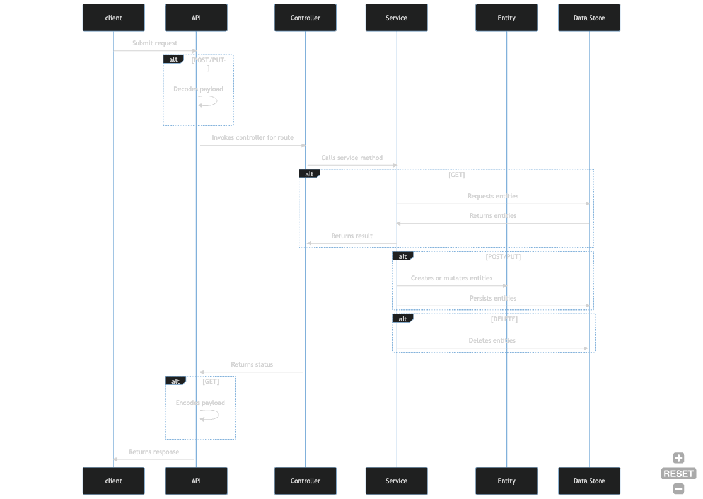

## Component Model

This section explains the Harbor **component model** as defined and implemented in the `harbcore` 
crate which can be found in the `core` directory of the repository.

The DoD [Architecture Framework](https://dodcio.defense.gov/Portals/0/Documents/DODAF/Vol_1_Sect_7-2-1_Component_Models.pdf)
defines the term component model this way:

> A Component Model describes the hierarchy of functional components, their responsibilities, 
> static relationships, and the way components collaborate to deliver required functionality."

With this definition in mind, here is a brief description the two primary consuers of the Harbor 
component model.

### Enrichment Engine

The enrichment engine can be conceptually modeled as:

- A set of **providers** that perform **tasks** that either manage **entities** (i.e. data) or 
  perform other functions necessary for Harbor to operate.
- The custom logic for a **task** is contained in a type that implements the `TaskProvider` trait. 
- The `cli` binary is the default mechanism for executing a `TaskProvider`.
- `TaskProvider` types call **services** from the `harbcore` crate to perform persistence 
  operations or domain functions such as uploading an SBOM.
- The default functions defined in the `TaskProvider` trait are responsible for reporting task 
  outcome/status, and collecting error information.
- **Services** wrap a `Store` instance and coordinate entity validation, persistence, and 
  relationships.

The diagram below illustrates this conceptual flow of activities.

### API

Similarly, the API module can be conceptually modeled as:

- A set of HTTP listeners implemented as `controllers`.
- A `controller` calls **services** from the `harbcore` crate to perform persistence
  operations or other domain functions such as uploading an SBOM.
- **Services** wrap a `Store` instance and coordinate entity validation, persistence, and
  relationships.

The diagram below illustrates this conceptual flow of activities.

