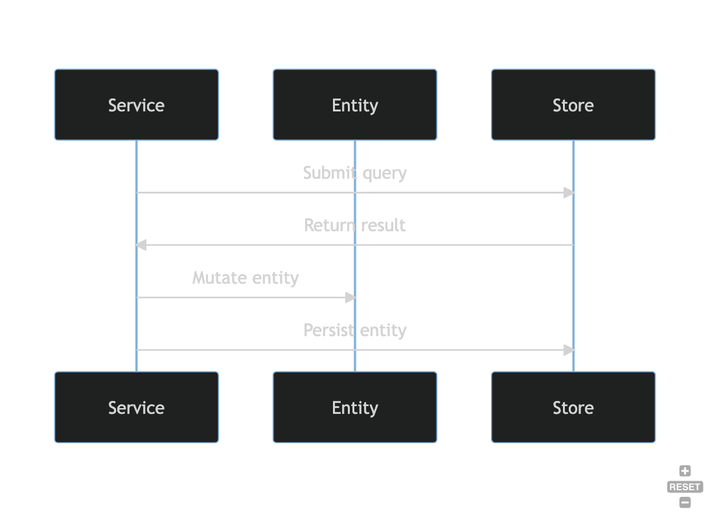

## MongoDB

The MongoDB module is an opinionated micro-framework for interacting with the MongoDB backend that 
Harbor currently supports. This module was developed based on the following needs and desires:

- At the time of initial development there did not seem to be a widely-used or well-maintained 
  Rust-based Object Document Mapper (ODM) available from the ecosystem. Database mapping code is 
  inherently full of boilerplate, which we equate to engineering toil, and can also be a 
  significant source of bugs. While the Rust type system helps with the latter issue to a great 
  degree, we still wanted to leverage generics to generate as much boilerplate code as possible.
- The official Mongo Rust Driver (see below) is wonderful, but also deep and finely-grained. 
  This is appropriate since it is a low-level driver designed to allow total control of 
  all aspects of MongoDB interaction. We wanted a way to abstract away that complexity and allow 
  developers to focus on domain logic rather than repeatedly handle infrastructure concerns.
- We wanted database interactions to be consistent and easily refactorable in a handful of places 
  rather than scattered throughout the codebase.
- The Mongo Rust Driver is designed in a very specific way in terms of [connection management](https://mongodb.github.io/mongo-rust-driver/manual/performance.html).
  Connections are designed to be long-lived, and we learned the hard way that they require a 
  significant amount of overhead to create, especially when negotiating TLS. We needed to provide a 
  convention-based way to ensure reuse of Mongo client instances when possible and appropriate, 
  which so far has been always.
- We needed a way to apply DB Migrations over time.
- We needed a way to dynamically and unpredictably layer in Authz controls. In order to do that 
  we needed to keep authorization concerns/data separate from the entity data itself. Building a 
  micro-framework gave us significant control and flexibility in this regard.

### Design

The basic interaction between the types and traits involved in data access are illustrated below.
The diagram documents an update sequence.

### DocumentDB Compatability

The Harbor team actually uses AWS DocumentDB as its data store. DocumentDB has some lag in terms of
MongoDB version support and feature compatability. Review the [AWS DocumentDB compatability](https://docs.aws.amazon.com/documentdb/latest/developerguide/compatibility.html)
page for an overview of what versions and features Harbor can support.

### Mongo Rust Driver

Harbor leverages [the official MongoDB Rust Driver](https://github.com/mongodb/mongo-rust-driver). 
Review their documentation for a comprehensive overview of how the driver works and how to work 
with the driver.
