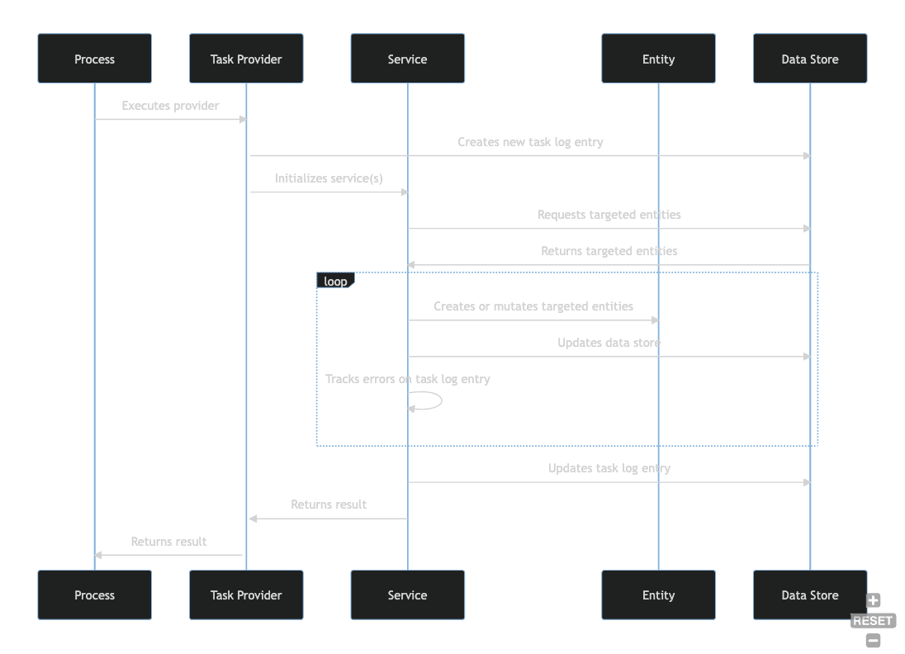

## Component Model

This section explains the Harbor **component model**. The DoD [Architecture Framework](https://dodcio.defense.gov/Portals/0/Documents/DODAF/Vol_1_Sect_7-2-1_Component_Models.pdf)
defines the term component model this way:

> A Component Model describes the hierarchy of functional components, their responsibilities, 
> static relationships, and the way components collaborate to deliver required functionality."

With this definition in mind Harbor can be conceptually modeled as a set of **services** that 
perform **tasks** that either manage and expose **entities** (i.e. data) or perform other 
functions necessary for Harbor to operate. The execution of a **task** is typically wrapped by a 
special type called a **provider** that is responsible for executing service logic, reporting 
task outcome/status, and collecting error information. The diagram below illustrates this conceptual 
flow of activities.

