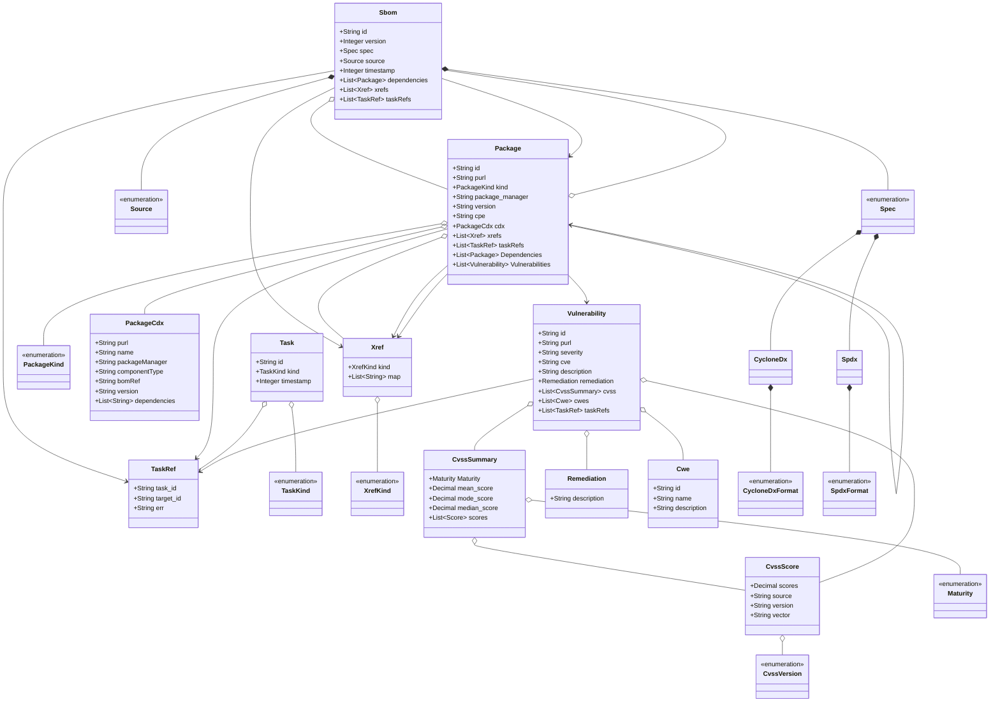

## Enrichments

```mermaid
classDiagram
    Sbom o-- Package
    Sbom --> Package
    Sbom *-- Source
    Sbom --> TaskRef
    Sbom *-- Spec
    Sbom --> Xref
    Package o-- Sbom
    Package o-- Xref
    Package o-- PackageKind
    Package o-- PackageCdx
    Package --> Package
    Package --> Xref
    Package --> Vulnerability
    Package --> Xref
    Package --> TaskRef
    Task o-- TaskKind
    Task o-- TaskRef
    Xref o-- XrefKind
    CvssSummary o-- CvssScore
    CvssSummary o-- Maturity
    CvssScore o-- CvssVersion
    Vulnerability o-- Remediation
    Vulnerability o-- CvssSummary
    Vulnerability o-- CvssScore
    Vulnerability o-- Cwe
    Vulnerability --> TaskRef
    Spec *-- CycloneDx
    Spec *-- Spdx
    CycloneDx *-- CycloneDxFormat
    Spdx *-- SpdxFormat

    class Package {
        +String id
        +String purl
        +PackageKind kind
        +String package_manager
        +String version
        +String cpe
        +PackageCdx cdx
        +List~Xref~ xrefs
        +List~TaskRef~ taskRefs
        +List~Package~ Dependencies
        +List~Vulnerability~ Vulnerabilities
    }

    class PackageCdx {
        +String purl
        +String name
        +String packageManager
        +String componentType
        +String bomRef
        +String version
        +List~String~ dependencies
    }

    class Sbom {
        +String id
        +Integer version
        +Spec spec
        +Source source
        +Integer timestamp
        +List~Package~ dependencies
        +List~Xref~ xrefs
        +List~TaskRef~ taskRefs
    }

    class Vulnerability {
        +String id
        +String purl
        +String severity
        +String cve
        +String description
        +Remediation remediation
        +List~CvssSummary~ cvss
        +List~Cwe~ cwes
        +List~TaskRef~ taskRefs

    }

    class CvssSummary {
        +Maturity Maturity
        +Decimal mean_score
        +Decimal mode_score
        +Decimal median_score
        +List~Score~ scores
    }

    class CvssScore {
        +Decimal scores
        +String source
        +String version
        +String vector
    }

    class Cwe {
        +String id
        +String name
        +String description
    }

    class Remediation {
        +String description
    }

    class Spdx {

    }

    class Task {
        +String id
        +TaskKind kind
        +Integer timestamp
    }

    class TaskRef {
        +String task_id
        +String target_id
        +String err
    }

    class Xref {
        +XrefKind kind
        +List~String~ map
    }

    class Maturity
    <<enumeration>> Maturity

    class TaskKind
    <<enumeration>> TaskKind
    
    class PackageKind
    <<enumeration>> PackageKind

    class Source
    <<enumeration>> Source

    class Spec
    <<enumeration>> Spec

    class CycloneDxFormat
    <<enumeration>> CycloneDxFormat

    class SpdxFormat
    <<enumeration>> SpdxFormat

    class XrefKind
    <<enumeration>> XrefKind

    class CvssVersion
    <<enumeration>> CvssVersion
```
