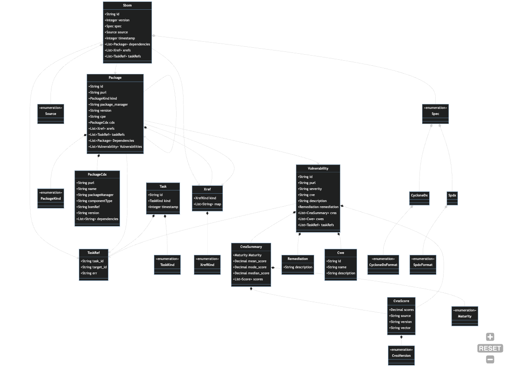

## Data Model

The following diagram provides an integrated overview of the Harbor data model. Data model types
can be found in the `core/src/entities` subdirectory and are further segregated by domain concern.
The diagram below shows the most important entities and their relationships across subsystems. 
See individual pages for diagrams that target each of the key entities.

