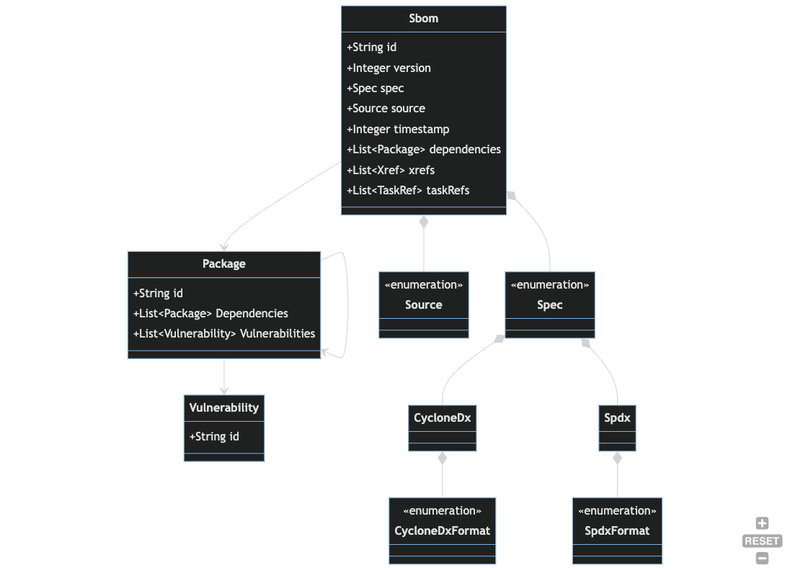

## SBOMs

The `Sbom` entity records that an SBOM was ingested or generated for a `Package` that is being
_directly monitored_. See the [`Packages`](./packages.md) documentation for a 
discussion.

### Data Dictionary

- `Sbom` - An SBOM is a snapshot manifest of the components that make up a piece of software at a 
    moment in time.
- `Package` - An inventory item from an `Sbom`. Can be defined by standard identifiers like CPE 
  or PURL.
- `Vulnerability` - An identified security vulnerability related to a `Package`.
- `Author` - The actor that provided or generated the Sbom. For vendor supplied SBOMS, this 
  will be the vendor name. For SBOMs generated via automation, this will be the name of the SBOM 
  provider that was used to generate the SBOM (e.g. Snyk, Syft).
- 
