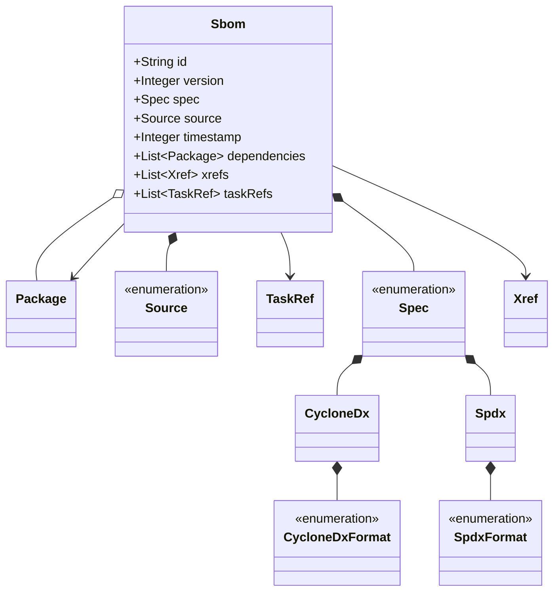

## SBOMs

```mermaid
classDiagram
    Sbom o-- Package
    Sbom --> Package
    Sbom *-- Source
    Sbom --> TaskRef
    Sbom *-- Spec
    Sbom --> Xref
    Spec *-- CycloneDx
    Spec *-- Spdx
    CycloneDx *-- CycloneDxFormat
    Spdx *-- SpdxFormat

    class Sbom {
        +String id
        +Integer version
        +Spec spec
        +Source source
        +Integer timestamp
        +List~Package~ dependencies
        +List~Xref~ xrefs
        +List~TaskRef~ taskRefs
    }

    class Spdx {

    }

    class Source
    <<enumeration>> Source

    class Spec
    <<enumeration>> Spec

    class CycloneDxFormat
    <<enumeration>> CycloneDxFormat

    class SpdxFormat
    <<enumeration>> SpdxFormat
```
