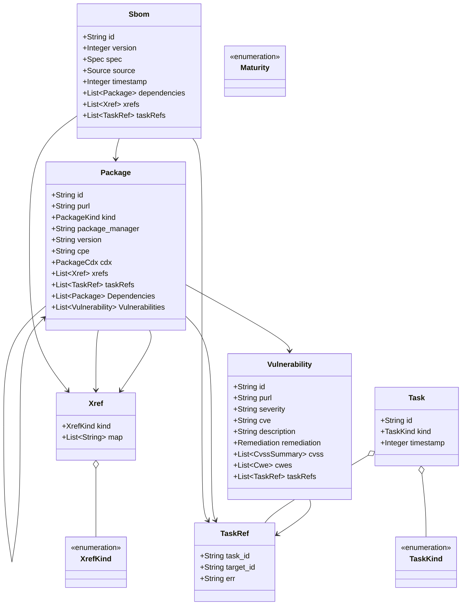

## Tasks

```mermaid
classDiagram
    Sbom --> Package
    Sbom --> TaskRef
    Sbom --> Xref
    Package --> Package
    Package --> Xref
    Package --> Vulnerability
    Package --> Xref
    Package --> TaskRef
    Task o-- TaskKind
    Task o-- TaskRef
    Xref o-- XrefKind
    Vulnerability --> TaskRef

    class Package {
        +String id
        +String purl
        +PackageKind kind
        +String package_manager
        +String version
        +String cpe
        +PackageCdx cdx
        +List~Xref~ xrefs
        +List~TaskRef~ taskRefs
        +List~Package~ Dependencies
        +List~Vulnerability~ Vulnerabilities
    }

    class Sbom {
        +String id
        +Integer version
        +Spec spec
        +Source source
        +Integer timestamp
        +List~Package~ dependencies
        +List~Xref~ xrefs
        +List~TaskRef~ taskRefs
    }

    class Vulnerability {
        +String id
        +String purl
        +String severity
        +String cve
        +String description
        +Remediation remediation
        +List~CvssSummary~ cvss
        +List~Cwe~ cwes
        +List~TaskRef~ taskRefs

    }

    class Task {
        +String id
        +TaskKind kind
        +Integer timestamp
    }

    class TaskRef {
        +String task_id
        +String target_id
        +String err
    }

    class Xref {
        +XrefKind kind
        +List~String~ map
    }

    class Maturity
    <<enumeration>> Maturity

    class TaskKind
    <<enumeration>> TaskKind

    class XrefKind
    <<enumeration>> XrefKind
```
