## Deployment

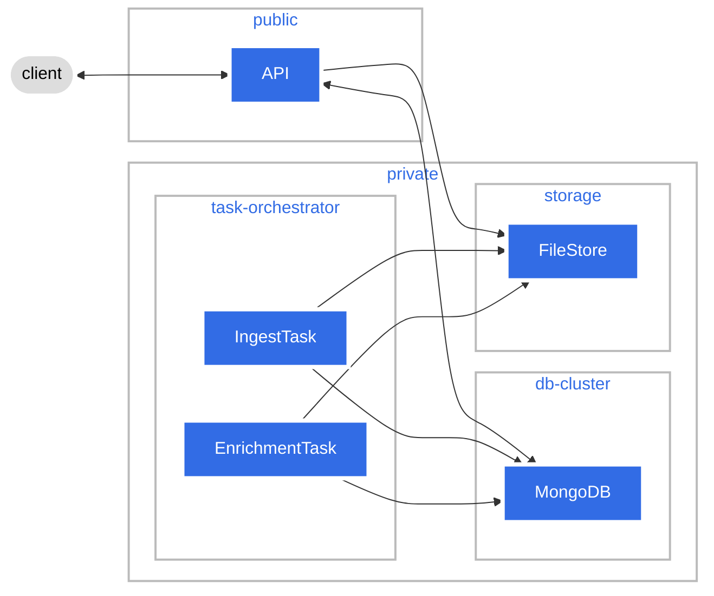

## Overview

## SBOM

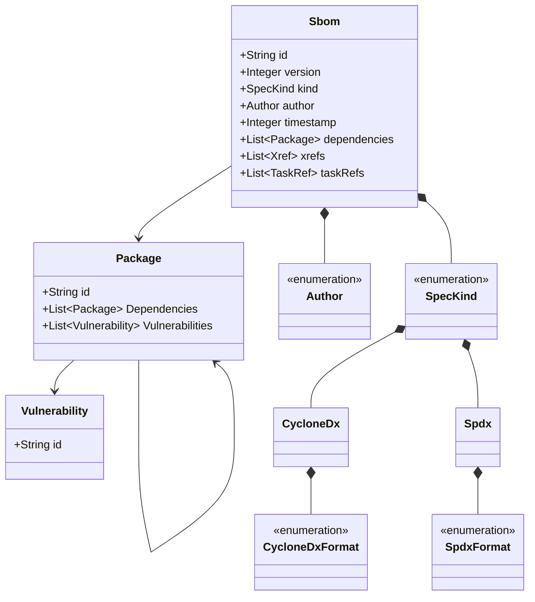

## Organizations

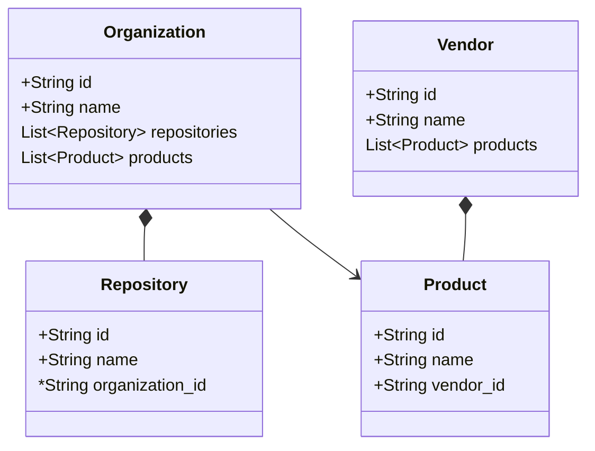

## Packages

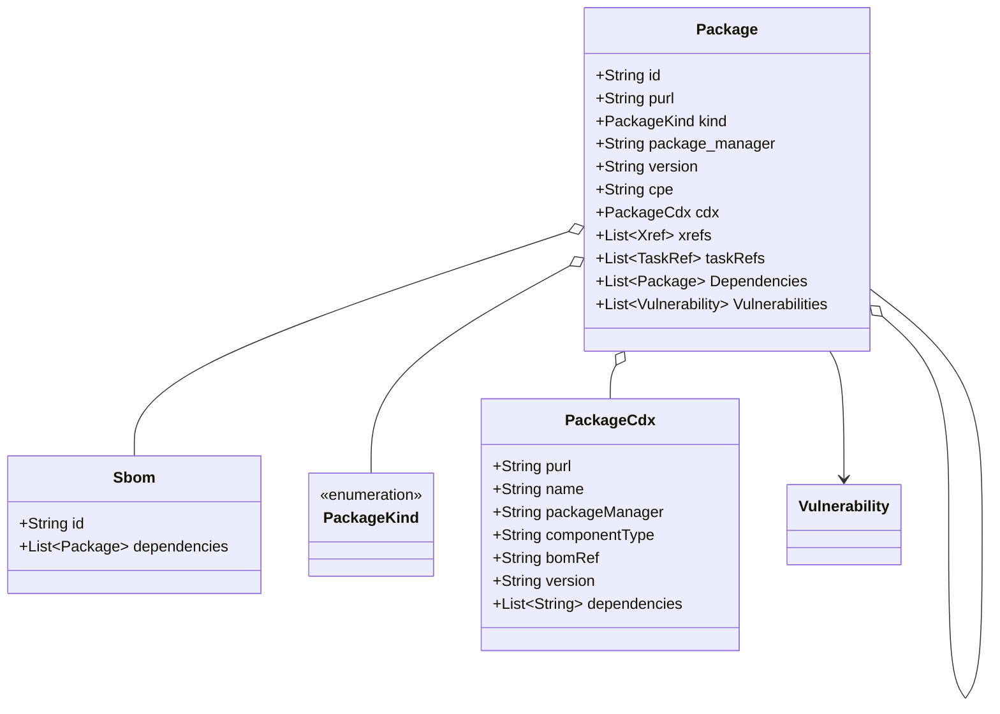

## Vulnerabilities

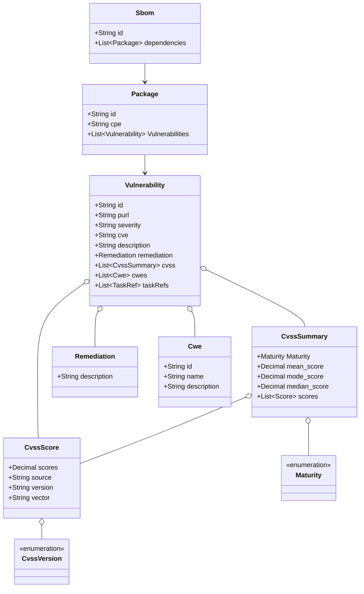

## Tasks

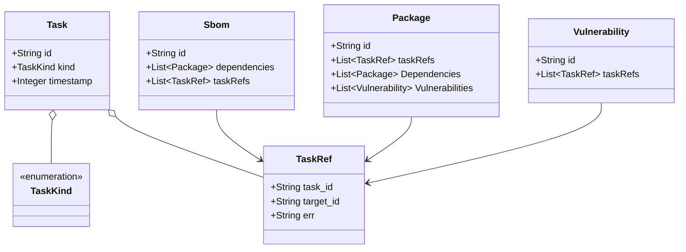

## Xrefs

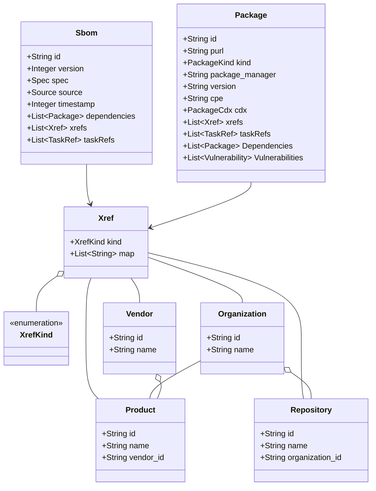

## Enrichment Engine Sequence

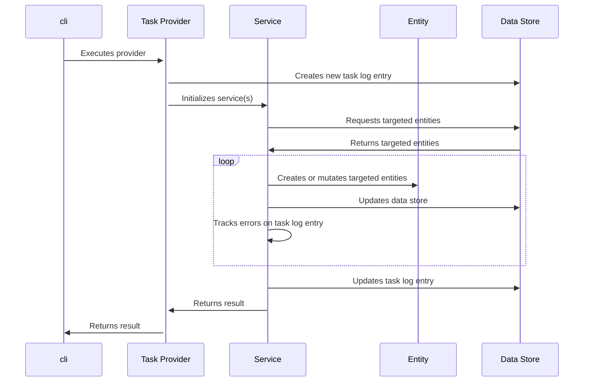

## API Sequence

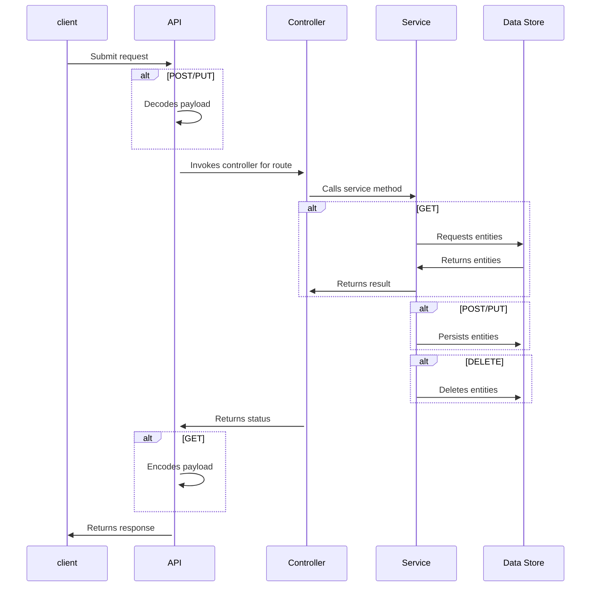

## MongoDB Overview

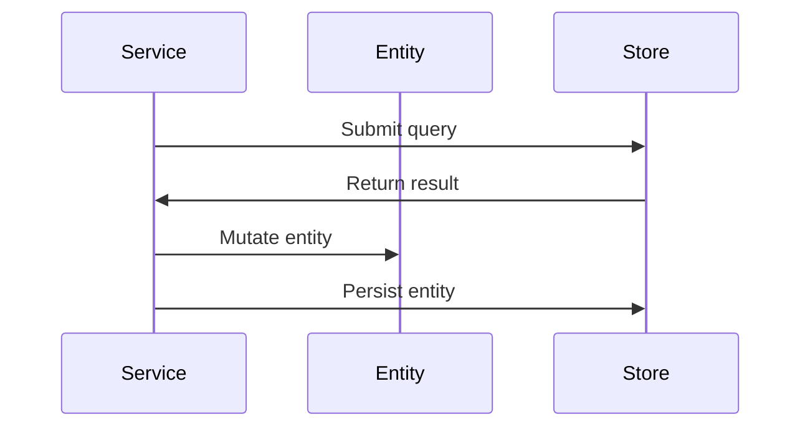

## Auth Overview

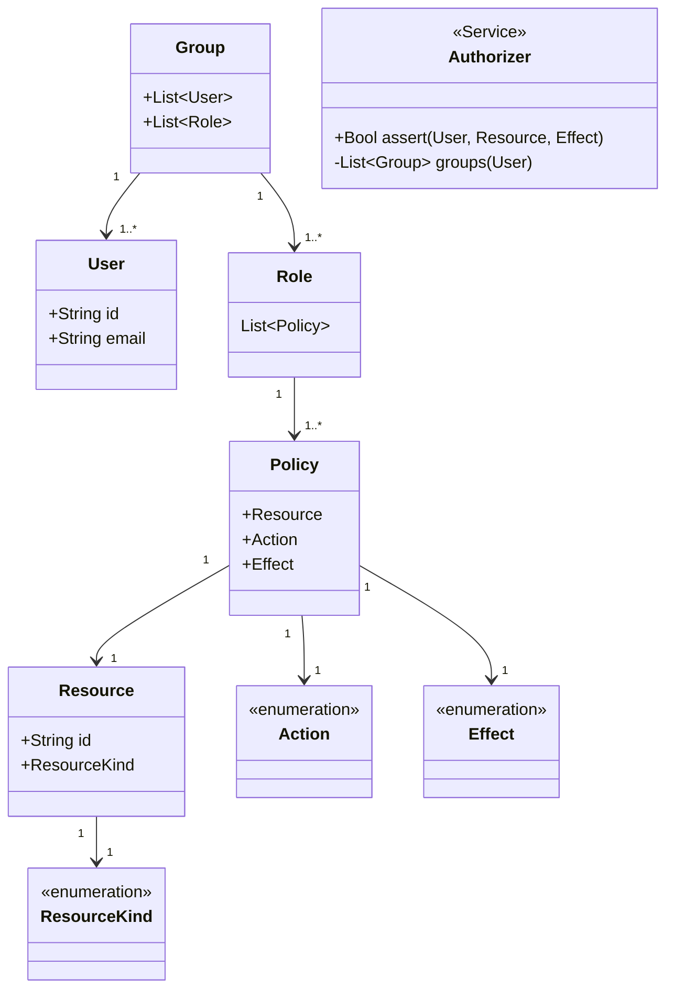
