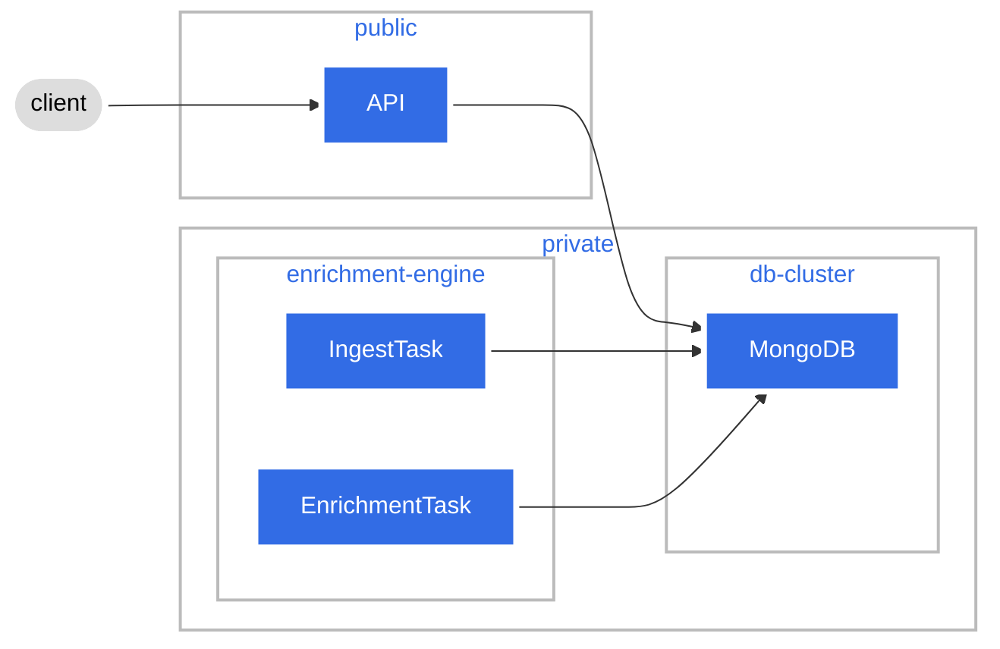
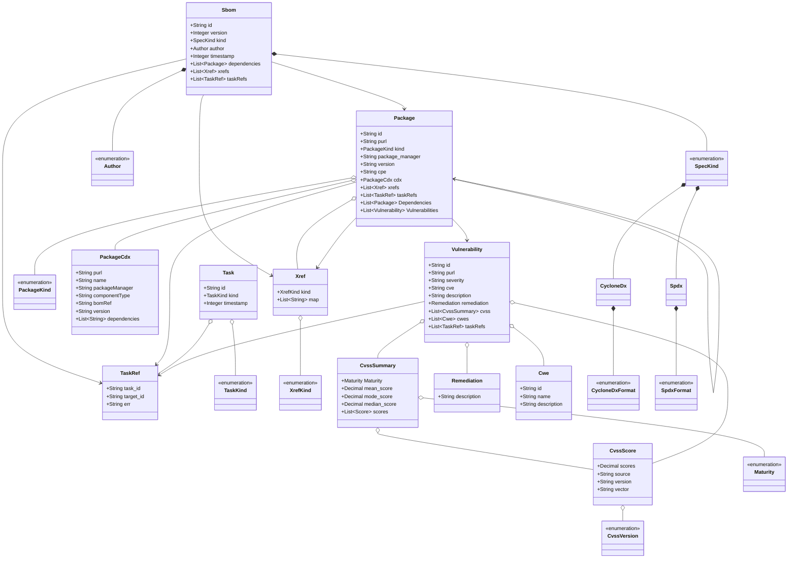
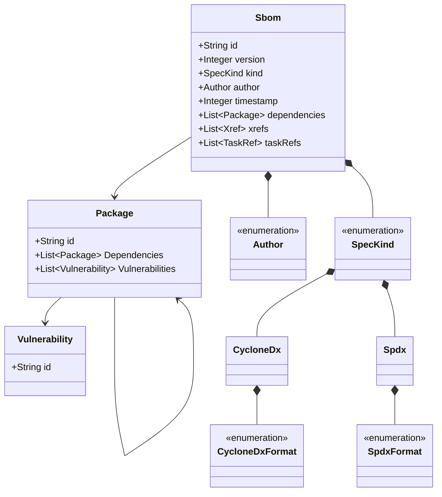
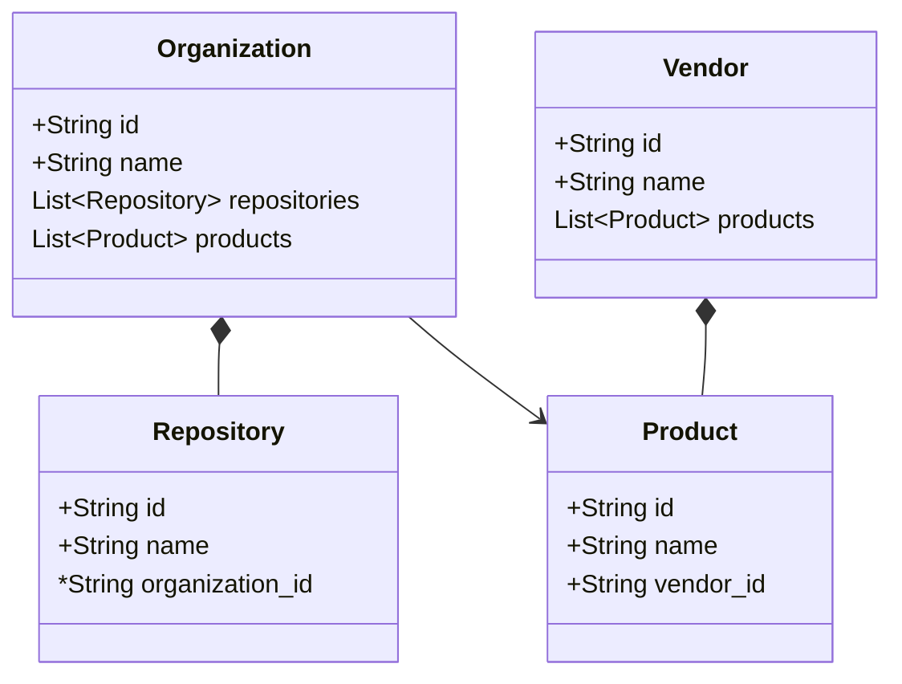
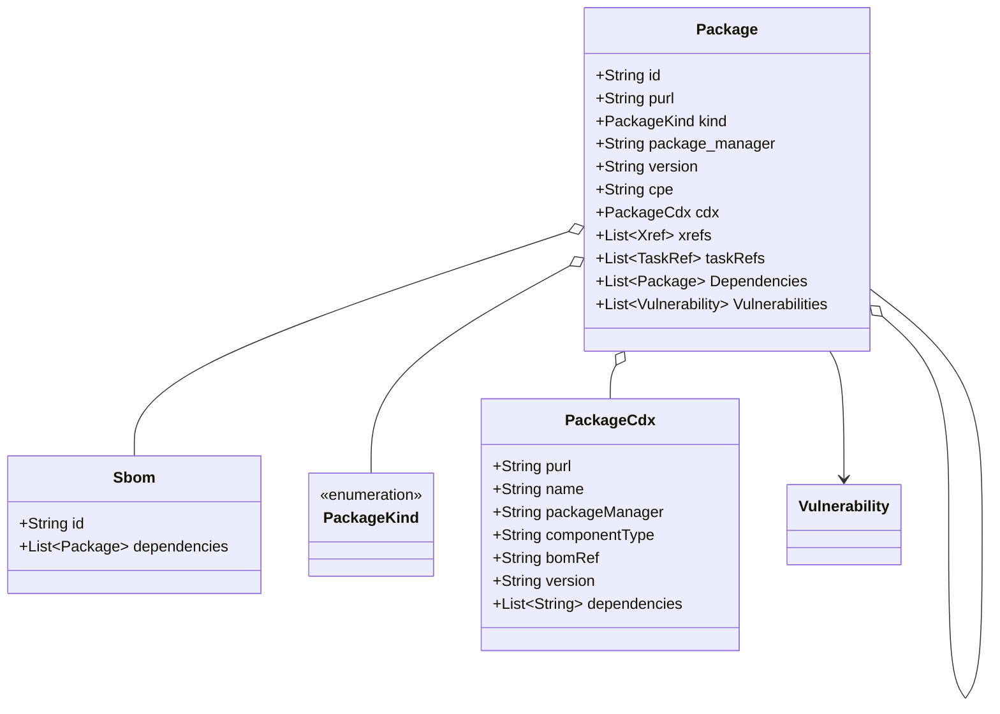
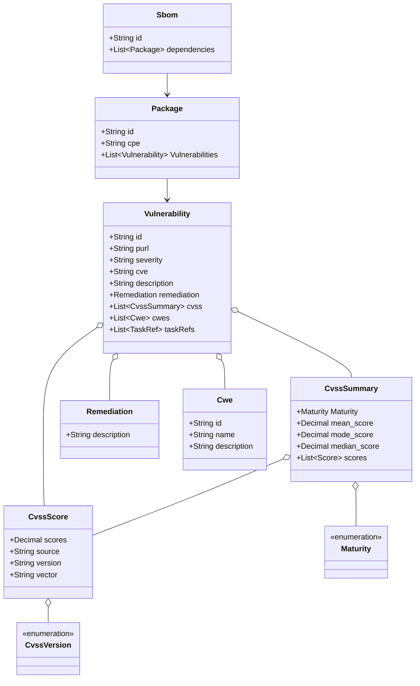
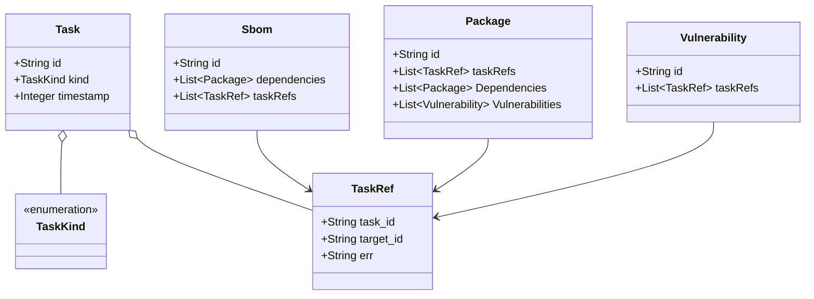
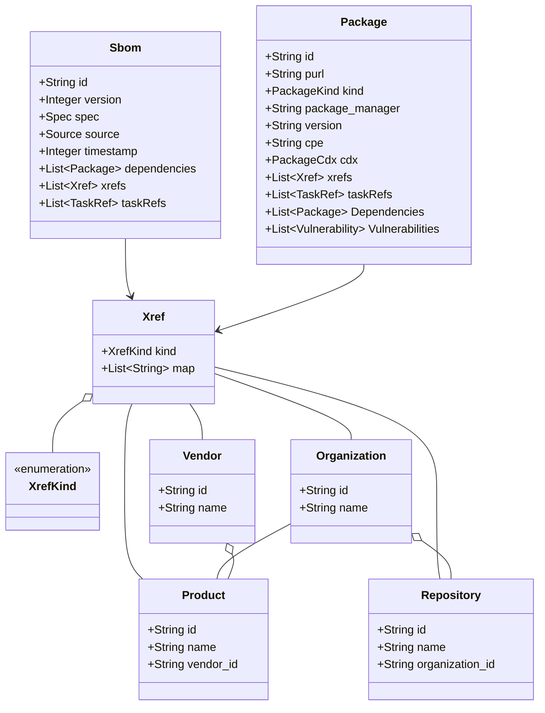

## Infrastructure

```mermaid
graph LR
    client([client])-->API[API];
    subgraph public
        API
    end
    subgraph private
        direction BT
        subgraph db-cluster
            API-->MongoDB
            MongoDB
        end
        subgraph enrichment-engine
            direction BT
            IngestTask
            EnrichmentTask
            IngestTask-->MongoDB[MongoDB]
            EnrichmentTask-->MongoDB[MongoDB]
        end
    end
 classDef plain fill:#ddd,stroke:#fff,stroke-width:4px,color:#000
 classDef component fill:#326ce5,stroke:#fff,stroke-width:4px,color:#fff
 classDef cluster fill:#fff,stroke:#bbb,stroke-width:2px,color:#326ce5
 class Ingress,API,IngestTask,EnrichmentTask,MongoDB component
 class client plain
 class public,private,db-cluster,enrichment-engine cluster
```

## Overview

```mermaid
classDiagram
    Sbom --> Package
    Sbom *-- Author
    Sbom --> TaskRef
    Sbom *-- SpecKind
    Sbom --> Xref
    Package o-- Xref
    Package o-- PackageKind
    Package o-- PackageCdx
    Package --> Package
    Package --> Vulnerability
    Package --> Xref
    Package --> TaskRef
    Task o-- TaskKind
    Task o-- TaskRef
    Xref o-- XrefKind
    CvssSummary o-- CvssScore
    CvssSummary o-- Maturity
    CvssScore o-- CvssVersion
    Vulnerability o-- Remediation
    Vulnerability o-- CvssSummary
    Vulnerability o-- CvssScore
    Vulnerability o-- Cwe
    Vulnerability --> TaskRef
    SpecKind *-- CycloneDx
    SpecKind *-- Spdx
    CycloneDx *-- CycloneDxFormat
    Spdx *-- SpdxFormat

    class Package {
        +String id
        +String purl
        +PackageKind kind
        +String package_manager
        +String version
        +String cpe
        +PackageCdx cdx
        +List~Xref~ xrefs
        +List~TaskRef~ taskRefs
        +List~Package~ Dependencies
        +List~Vulnerability~ Vulnerabilities
    }

    class PackageCdx {
        +String purl
        +String name
        +String packageManager
        +String componentType
        +String bomRef
        +String version
        +List~String~ dependencies
    }

    class Sbom {
        +String id
        +Integer version
        +SpecKind kind
        +Author author
        +Integer timestamp
        +List~Package~ dependencies
        +List~Xref~ xrefs
        +List~TaskRef~ taskRefs
    }

    class Vulnerability {
        +String id
        +String purl
        +String severity
        +String cve
        +String description
        +Remediation remediation
        +List~CvssSummary~ cvss
        +List~Cwe~ cwes
        +List~TaskRef~ taskRefs

    }

    class CvssSummary {
        +Maturity Maturity
        +Decimal mean_score
        +Decimal mode_score
        +Decimal median_score
        +List~Score~ scores
    }

    class CvssScore {
        +Decimal scores
        +String source
        +String version
        +String vector
    }

    class Cwe {
        +String id
        +String name
        +String description
    }

    class Remediation {
        +String description
    }

    class Task {
        +String id
        +TaskKind kind
        +Integer timestamp
    }

    class TaskRef {
        +String task_id
        +String target_id
        +String err
    }

    class Xref {
        +XrefKind kind
        +List~String~ map
    }

    class Maturity
    <<enumeration>> Maturity

    class TaskKind
    <<enumeration>> TaskKind
    
    class PackageKind
    <<enumeration>> PackageKind

    class CycloneDx {

    }

    class Spdx {

    }

    class Author
    <<enumeration>> Author

    class SpecKind
    <<enumeration>> SpecKind

    class CycloneDxFormat
    <<enumeration>> CycloneDxFormat

    class SpdxFormat
    <<enumeration>> SpdxFormat

    class XrefKind
    <<enumeration>> XrefKind

    class CvssVersion
    <<enumeration>> CvssVersion
```

## SBOM

```mermaid
classDiagram
    Sbom --> Package
    Sbom *-- Author
    Sbom *-- SpecKind
    Package --> Package
    Package --> Vulnerability
    SpecKind *-- CycloneDx
    SpecKind *-- Spdx
    CycloneDx *-- CycloneDxFormat
    Spdx *-- SpdxFormat

    class Package {
        +String id
        +List~Package~ Dependencies
        +List~Vulnerability~ Vulnerabilities
    }

    class Sbom {
        +String id
        +Integer version
        +SpecKind kind
        +Author author
        +Integer timestamp
        +List~Package~ dependencies
        +List~Xref~ xrefs
        +List~TaskRef~ taskRefs
    }

    class Vulnerability {
        +String id
    }

    class CycloneDx {

    }

    class Spdx {

    }

    class Author
    <<enumeration>> Author

    class SpecKind
    <<enumeration>> SpecKind

    class CycloneDxFormat
    <<enumeration>> CycloneDxFormat

    class SpdxFormat
    <<enumeration>> SpdxFormat
```

## Organizations

```mermaid
classDiagram
    Organization *-- Repository
    Organization --> Product
    Vendor *-- Product

    class Organization {
        +String id
        +String name
        List~Repository~ repositories
        List~Product~ products
    }

    class Repository {
        +String id
        +String name
        *String organization_id
    }

    class Vendor {
        +String id
        +String name
        List~Product~ products
    }

    class Product {
        +String id
        +String name
        +String vendor_id
    }
```

## Packages

```mermaid
classDiagram
    Package o-- Sbom
    Package o-- PackageKind
    Package o-- PackageCdx
    Package o-- Package
    Package --> Vulnerability

    class Package {
        +String id
        +String purl
        +PackageKind kind
        +String package_manager
        +String version
        +String cpe
        +PackageCdx cdx
        +List~Xref~ xrefs
        +List~TaskRef~ taskRefs
        +List~Package~ Dependencies
        +List~Vulnerability~ Vulnerabilities
    }

    class PackageCdx {
        +String purl
        +String name
        +String packageManager
        +String componentType
        +String bomRef
        +String version
        +List~String~ dependencies
    }

    class Sbom {
        +String id
        +List~Package~ dependencies
    }
    
    class PackageKind
    <<enumeration>> PackageKind
```

## Vulnerabilities

```mermaid
classDiagram
    Sbom --> Package

    Package --> Vulnerability

    CvssSummary o-- CvssScore
    CvssSummary o-- Maturity
    CvssScore o-- CvssVersion
    Vulnerability o-- Remediation
    Vulnerability o-- CvssSummary
    Vulnerability o-- CvssScore
    Vulnerability o-- Cwe

    class Package {
        +String id
        +String cpe
        +List~Vulnerability~ Vulnerabilities
    }

    class Sbom {
        +String id
        +List~Package~ dependencies
    }

    class Vulnerability {
        +String id
        +String purl
        +String severity
        +String cve
        +String description
        +Remediation remediation
        +List~CvssSummary~ cvss
        +List~Cwe~ cwes
        +List~TaskRef~ taskRefs

    }

    class CvssSummary {
        +Maturity Maturity
        +Decimal mean_score
        +Decimal mode_score
        +Decimal median_score
        +List~Score~ scores
    }

    class CvssScore {
        +Decimal scores
        +String source
        +String version
        +String vector
    }

    class Cwe {
        +String id
        +String name
        +String description
    }

    class Remediation {
        +String description
    }

    class Maturity
    <<enumeration>> Maturity

    class CvssVersion
    <<enumeration>> CvssVersion
```

## Tasks

```mermaid
classDiagram
    Task o-- TaskKind
    Task o-- TaskRef
    Sbom --> TaskRef
    Package --> TaskRef
    Vulnerability --> TaskRef

    class Package {
        +String id
        +List~TaskRef~ taskRefs
        +List~Package~ Dependencies
        +List~Vulnerability~ Vulnerabilities
    }

    class Sbom {
        +String id
        +List~Package~ dependencies
        +List~TaskRef~ taskRefs
    }

    class Vulnerability {
        +String id
        +List~TaskRef~ taskRefs
    }

    class Task {
        +String id
        +TaskKind kind
        +Integer timestamp
    }

    class TaskRef {
        +String task_id
        +String target_id
        +String err
    }

    class TaskKind
    <<enumeration>> TaskKind
```

## Xrefs

```mermaid
classDiagram
    Sbom --> Xref
    Package --> Xref
    Xref o-- XrefKind
    Xref -- Organization
    Xref -- Repository
    Xref -- Vendor
    Xref -- Product
    Organization -- Product
    Organization o-- Repository
    Vendor o-- Product

    class Organization {
        +String id
        +String name
    }

    class Repository {
        +String id
        +String name
        +String organization_id
    }

    class Vendor {
        +String id
        +String name
    }

    class Product {
        +String id
        +String name
        +String vendor_id
    }

    class Package {
        +String id
        +String purl
        +PackageKind kind
        +String package_manager
        +String version
        +String cpe
        +PackageCdx cdx
        +List~Xref~ xrefs
        +List~TaskRef~ taskRefs
        +List~Package~ Dependencies
        +List~Vulnerability~ Vulnerabilities
    }

    class Sbom {
        +String id
        +Integer version
        +Spec spec
        +Source source
        +Integer timestamp
        +List~Package~ dependencies
        +List~Xref~ xrefs
        +List~TaskRef~ taskRefs
    }

    class Xref {
        +XrefKind kind
        +List~String~ map
    }

    class XrefKind
    <<enumeration>> XrefKind
```
