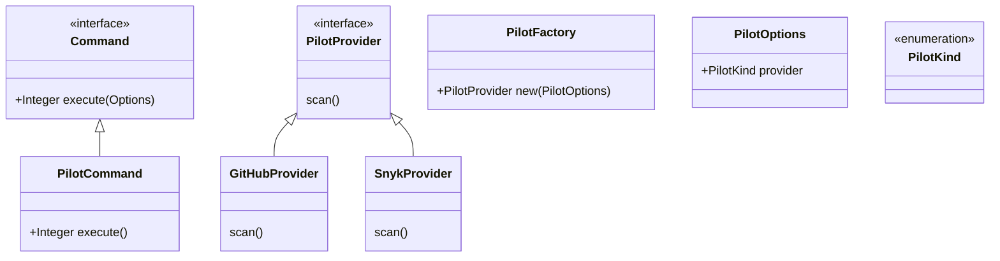

### Harbor Cli

#### Class DIagram

```mermaid
classDiagram
    Command <|-- PilotCommand
    PilotProvider <|-- GitHubProvider
    PilotProvider <|-- SnykProvider

    class Command {
        <<interface>>
        +Integer execute(Options)
    }

    class PilotCommand {
        +Integer execute()
    }

    class PilotFactory {
        +PilotProvider new(PilotOptions)
    }

    class PilotOptions {
      +PilotKind provider
    }

    class PilotKind
    <<enumeration>> PilotKind

    class PilotProvider {
        <<interface>>
        scan()
    }

    class GitHubProvider {
        scan()
    }

    class SnykProvider {
        scan()
    }
```
