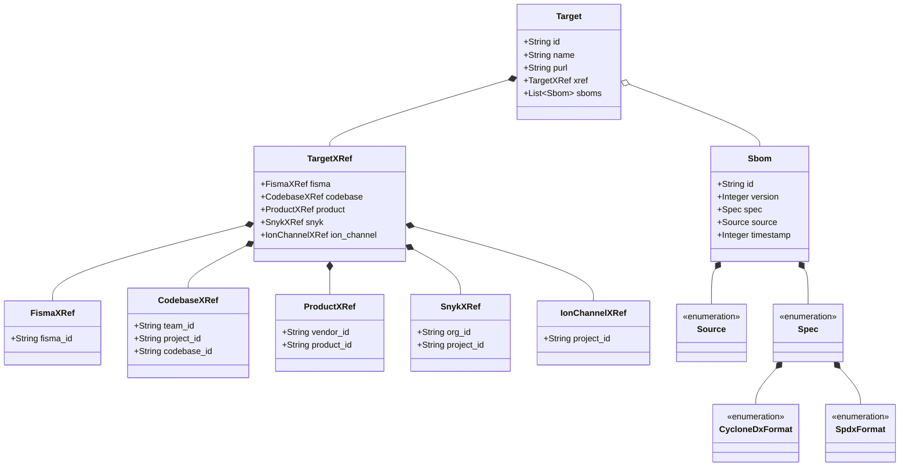

```mermaid
classDiagram
    Target o-- Sbom
    Target *-- TargetXRef
    TargetXRef *-- FismaXRef
    TargetXRef *-- CodebaseXRef
    TargetXRef *-- ProductXRef
    TargetXRef *-- SnykXRef
    TargetXRef *-- IonChannelXRef    
    Sbom *-- Source
    Sbom *-- Spec
    Spec *-- CycloneDxFormat
    Spec *-- SpdxFormat

    class Target {
        +String id
        +String name
        +String purl
        +TargetXRef xref
        +List~Sbom~ sboms
    }

    class Sbom {
        +String id
        +Integer version
        +Spec spec
        +Source source
        +Integer timestamp
    }

    class Source
    <<enumeration>> Source

    class Spec
    <<enumeration>> Spec

    class CycloneDxFormat
    <<enumeration>> CycloneDxFormat

    class SpdxFormat
    <<enumeration>> SpdxFormat

    class TargetXRef {
        +FismaXRef fisma
        +CodebaseXRef codebase
        +ProductXRef product
        +SnykXRef snyk
        +IonChannelXRef ion_channel
    }

    class FismaXRef {
        +String fisma_id
    }

    class CodebaseXRef {
        +String team_id
        +String project_id
        +String codebase_id
    }

    class ProductXRef {
        +String vendor_id
        +String product_id
    }

    class SnykXRef {
        +String org_id
        +String project_id
    }

    class IonChannelXRef {
        +String project_id
    }
```