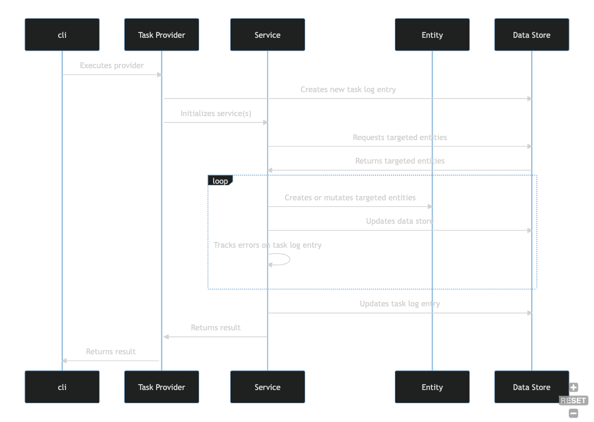

## Core Crate

The `core` crate contains reusable functionality related to the fundamental Harbor domain. This
crate defines default and mandatory behaviors and enforces all rules related to data integrity. 
Community members that are developing their own custom extensions or who wish to contribute to 
upstream Harbor are encouraged to review the code in this crate, and take care not to perform data
mutations that are incompatible with upstream Harbor. Community members should likely leverage
the services defined in this crate as-is, or interact with the API.

The two built-in consumers of the `core` crate are the _*Enrichment Engine*_ and the _*API*_.

### Enrichment Engine

The _**Enrichment Engine**_ is:

- A set of **providers** that perform **tasks** that either manage **entities** (i.e. data) or 
  perform other functions necessary for Harbor to operate.
- The custom logic for a **task** is contained in a type that implements the `TaskProvider` trait. 
- The `cli` binary is the default mechanism for executing a `TaskProvider`.
- `TaskProvider` types call **services** from the `core` crate to perform persistence 
  operations or domain functions such as uploading an SBOM.
- The default functions defined in the `TaskProvider` trait are responsible for reporting task 
  outcome/status, and collecting error information.
- The `run` function in a `TaskProvider` is responsible for executing **task specific** logic that 
  usually involves invoking or more **services** that mutate the data store.
- A `Service` wraps a shared `Store` instance and coordinates entity validation, persistence, 
  and relationships.

The diagram below illustrates this flow of activities.

### API

The _**API**_ is:

- A single binary that configures dependency injection, tracing, and error handling, and 
  then starts an HTTP listener.
- The listener decodes payloads, enforces authz, and routes requests to handlers that are 
  implemented as `controllers`.
- A `controller` calls **services** from the `core` crate to perform persistence operations or other 
  domain functions such as ingesting an SBOM.
- A `Service` wraps a shared `Store` instance and coordinates entity validation, persistence,
  and relationships.

The diagram below illustrates this flow of activities.

