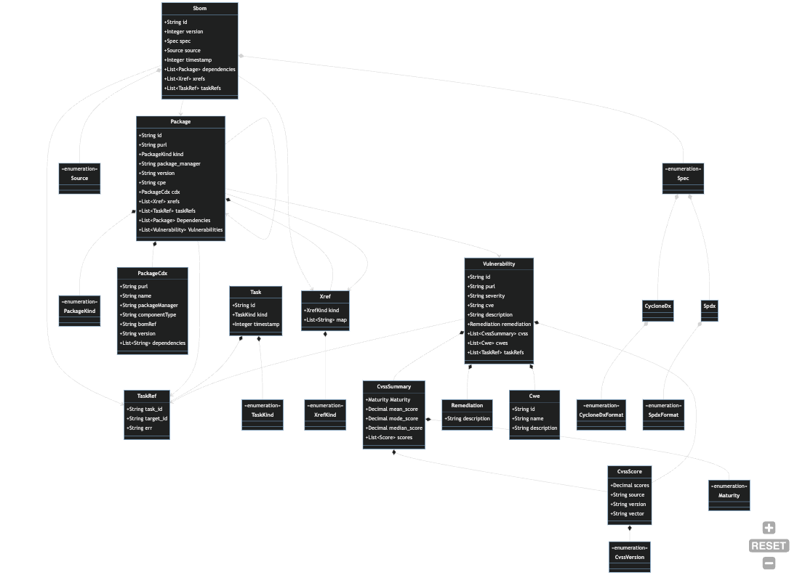

## Data Model

The following diagram provides an integrated overview of the Harbor data model. Data model types
can be found in the `sdk/core/src/entities` subdirectory and are further segregated by subdomain.
The diagram below shows a high level overview of the entities and their relationships. See 
entity specific pages for diagrams and explanations of each subdomain.

