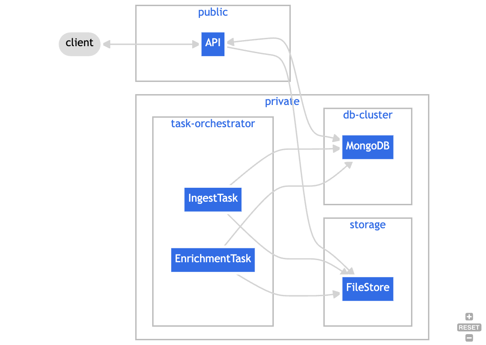

## Deployment

All the current features revolve around:

Ingestion
- Collecting and storing SBOM files
- Analyzing SBOM contents
- Translating analysis results to the Harbor data model
- Persisting results to a MongoDB-compliant data store

Enrichment
- Collecting and storing vulnerability data related to SBOMs
- Collecting and storing metadata about vulnerabilities
- Collecting and storing quality metrics related to SBOM contents

Analytics
- Providing programmatic access to the analysis results

To support these use cases, we have designed Harbor with the fundamental expectation that a typical 
instance is made up of the following resources:

- MongoDB instance
- File/Object storage
- API
- Task Orchestrator

