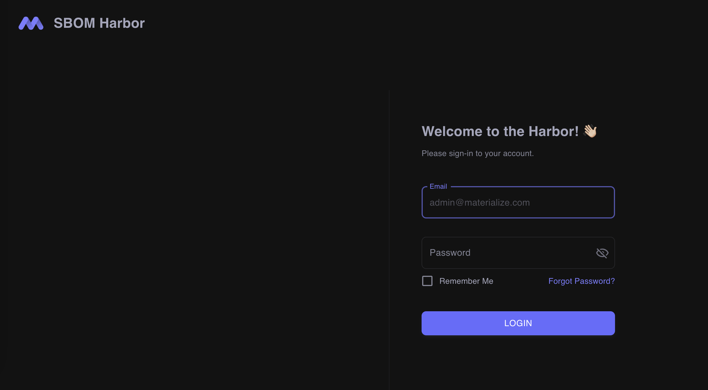

## Does Harbor have a User Interface?

Yes!

The Harbor UI is maintained in a separate repository which can be found [here](https://github.com/CMS-Enterprise/sbom-harbor-ui). 
All contributing guidelines documented here are applicable for that repository as well, and pull 
requests are welcome!

