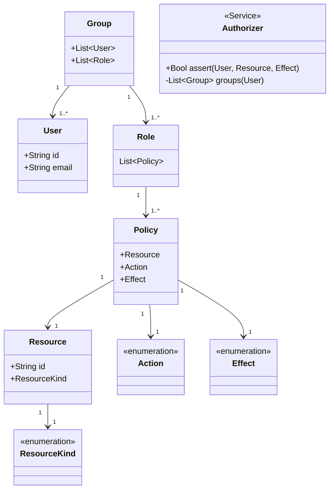

## Overview

The `auth` module provides a reusable struct model and `Authorizer` trait that can be used with any datastore in the case
that you need to role your own RBAC. It is based on the AWS IAM model. The `Authorizer` trait is decoupled from the
underlying datastore. Consumers of this crate have to implement their own data storage/access strategy. See the
`DefaultAuthorizer` in the `mongo` package in this crate for an example.

See the `mongodb.auth.init_default_auth` module for a re-usable database migration that will initialize
an opinionated authorization configuration.

This package does not currently provide any authentication features but likely will.

